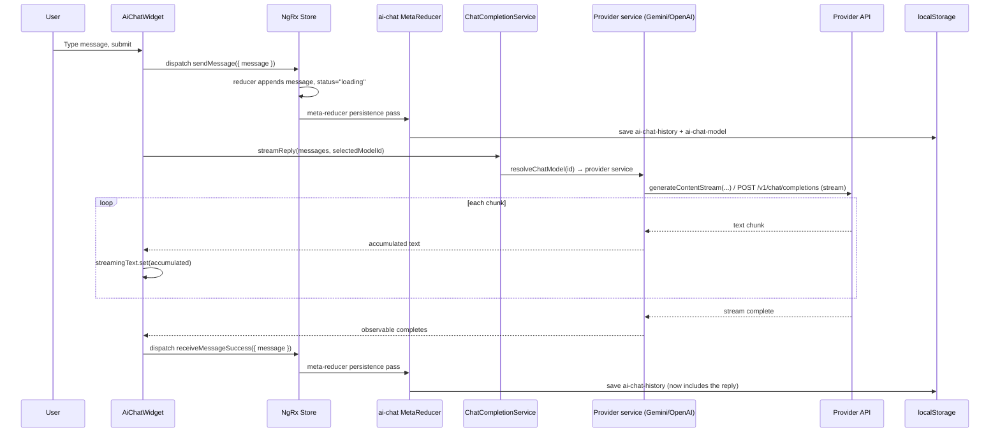
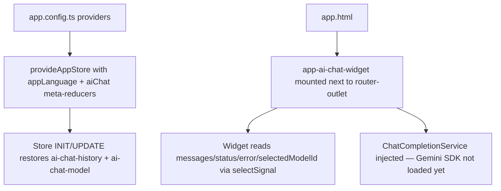

# AI Chat Widget (Gemini + OpenAI): Detailed Technical Spec

## 1. Purpose

The AI chat widget is a floating assistant, backed by Google's Gemini API or OpenAI's chat completions API — the user picks the model from the panel header — available from every route in the app (public and dashboard layouts alike).

It is designed so that:

- One ongoing conversation is available globally — no per-page chat state, no multi-conversation management.
- The provider API is called directly from the browser (there is no backend in this app), so replies stream back token-by-token.
- Conversation history and the selected model persist across reloads/navigation via `localStorage`, following the same NgRx meta-reducer pattern already used for language persistence (see [lang-switcher.md](lang-switcher.md) §5).
- The widget degrades gracefully with a translated, retryable error message whenever the selected provider can't be reached — missing key, network failure, quota limit, or any other failure.

Design/implementation history: `docs/superpowers/specs/2026-08-22-ai-chat-widget-design.md` and `docs/superpowers/plans/2026-08-22-ai-chat-widget.md` at the repo root.

---

## 2. Main Files and Responsibilities

- `src/app/shared/components/ai-chat-widget/ai-chat-widget.ts`
	- Floating button + panel component. Owns the async orchestration (calling Gemini, dispatching success/failure) — there is no `@ngrx/effects` in this app, so this component is the only place that bridges the store and the Gemini service.
- `src/app/shared/components/ai-chat-widget/ai-chat-widget.html`
	- FAB + expandable panel markup: header (title, "new chat", close), scrollable message list, streaming bubble, error bubble with Retry, and the send form.
- `src/app/shared/services/markdown-renderer.ts`
	- `renderMarkdown(markdown, options)` — the small hand-rolled Markdown → HTML renderer used for assistant replies (§8.1).
- `src/app/shared/pipes/markdown.pipe.ts`
	- `MarkdownPipe` — pure pipe wrapping the renderer, returns `SafeHtml` for `[innerHTML]`.
- `src/app/core/services/chat-models.ts`
	- `CHAT_MODELS` registry (`ChatModelOption`: `id`, `provider`, `model`, `labelKey`), `DEFAULT_CHAT_MODEL_ID`, `isChatModelId`, `resolveChatModel`. Single source of truth for the picker and for provider dispatch.
- `src/app/core/services/chat-error.ts`
	- `ChatErrorCode`, `ChatError`, `toChatError` — one error vocabulary shared by both providers.
- `src/app/core/services/chat-completion.service.ts`
	- `ChatCompletionService` — turns the selected model id into a provider call; the only chat service the widget injects.
- `src/app/core/services/gemini-chat.service.ts`
	- `GeminiChatService` — wraps `@google/genai`, exposes `streamReply(history, model): Observable<string>`.
- `src/app/core/services/openai-chat.service.ts`
	- `OpenAiChatService` — same contract over `fetch` + SSE against `https://api.openai.com/v1/chat/completions`; no SDK dependency.
- `src/app/core/store/ai-chat/*`
	- `ai-chat.models.ts` — `ChatMessage`, `ChatStatus`, the `isChatMessage` runtime guard.
	- `ai-chat.actions.ts` — `AiChatActions` (`sendMessage`, `retryLastMessage`, `receiveMessageSuccess`, `receiveMessageFailure`, `clearConversation`, `selectModel`).
	- `ai-chat.reducer.ts` — `aiChatReducer`, feature key `aiChat`.
	- `ai-chat.selectors.ts` — `selectAiChatMessages`, `selectAiChatStatus`, `selectAiChatError`, `selectAiChatSelectedModelId`.
- `src/app/core/store/meta-reducers/ai-chat-storage.metareducer.ts`
	- Persists/restores `messages` and `selectedModelId` from `localStorage`.
- `src/app/core/store/app.state.ts` / `src/app/core/store/index.ts` / `src/app/core/store/app-store.providers.ts`
	- Wire the `aiChat` feature and its meta-reducer into the root store, alongside `appLanguage`.
- `src/environments/env.model.ts` / `env.ts` / `env.dev.ts` / `env.production.ts`
	- `geminiApiKey: string` and `openaiApiKey: string` fields. All three committed environment files ship **empty strings** — no real key is ever committed.
- `public/i18n/generic-app/{en,bn}.json`
	- `aiChat.*` translation keys (the widget is global, so it lives in the always-loaded `generic-app` module — see [lang-switcher.md](lang-switcher.md) §9.1).
- `src/app/app.ts` + `src/app/app.html`
	- Mount `<app-ai-chat-widget />` once, next to `<router-outlet />`, so it renders on every route.

---

## 3. Data Model

From `ai-chat.models.ts`:

```typescript
interface ChatMessage {
  id: string;
  role: 'user' | 'assistant';
  content: string;
  createdAt: number;
}

type ChatStatus = 'idle' | 'loading' | 'error';
```

`isChatMessage(value): value is ChatMessage` is a runtime type guard used only by the persistence meta-reducer, to validate whatever comes back out of `localStorage` before trusting it.

Store shape (`AiChatState`, feature key `aiChat`):

```typescript
interface AiChatState {
  messages: ChatMessage[];
  status: ChatStatus;
  error: string | null;
  selectedModelId: string;
}
```

`error` is a `string`, not the narrower `ChatErrorCode` union — it's expected to be one of `'missingKey' | 'network' | 'quota' | 'unknown'` by convention (that's what the component ever dispatches), but the type itself doesn't enforce it. The template resolves it as a translation key: `'aiChat.errors.' + error()`.

---

## 4. State Management Design (NgRx)

Actions (`AiChatActions`, source `'AI Chat'`):

| Action | Payload | Reducer effect |
|---|---|---|
| `sendMessage` | `{ message: ChatMessage }` | Appends the message, `status → 'loading'`, clears `error` |
| `retryLastMessage` | — | `status → 'loading'`, clears `error`; messages unchanged (the last user message is still in `messages`, so a retry just re-sends the existing history) |
| `receiveMessageSuccess` | `{ message: ChatMessage }` | Appends the assistant message, `status → 'idle'`, clears `error` |
| `receiveMessageFailure` | `{ error: string }` | `status → 'error'`, sets `error`; messages unchanged |
| `clearConversation` | — | Resets `messages`/`status`/`error` to the initial state, **keeping** `selectedModelId` — the model is a standing preference, not part of the conversation |
| `selectModel` | `{ modelId: string }` | Sets `selectedModelId`, `status → 'idle'`, clears `error`; messages unchanged |

Selectors: `selectAiChatMessages`, `selectAiChatStatus`, `selectAiChatError`, `selectAiChatSelectedModelId`, all derived from `selectAiChatState` (`createFeatureSelector('aiChat')`).

No `@ngrx/effects` is used anywhere in this app. The widget component dispatches `sendMessage`/`retryLastMessage` synchronously, then separately calls `ChatCompletionService.streamReply(...)` and dispatches `receiveMessageSuccess`/`receiveMessageFailure` itself once the observable settles.

---

## 5. Persistence Flow (Meta Reducer)

Storage keys: `ai-chat-history` (the messages) and `ai-chat-model` (the selected model id — kept separate so an existing stored conversation stays readable).

Only `messages` and `selectedModelId` are persisted — `status` and `error` are treated as transient/session-only and are never written to or read from storage. This means a page reload always resumes with `status: 'idle'`, even if the tab was closed mid-error.

On `INIT`/`UPDATE`:

0. Read `localStorage['ai-chat-model']`; it replaces `selectedModelId` only if `isChatModelId` still recognizes it, so a model retired from `CHAT_MODELS` silently falls back to the default.
1. Read `localStorage['ai-chat-history']`.
2. `JSON.parse` inside a try/catch — malformed JSON is treated as "nothing stored".
3. Validate the parsed value is an array where every entry passes `isChatMessage`. A partially-corrupt array (even one bad entry) is rejected wholesale, not filtered.
4. If valid, overwrite `messages` in the hydrated state.

On every dispatched action (any action, not just `aiChat` ones — same as the language meta-reducer):

1. Serialize the current `messages` array.
2. `window.localStorage.setItem(...)` inside a try/catch that silently swallows the error (e.g. `QuotaExceededError` on a very long conversation, or `SecurityError` in some private-browsing contexts). This matters specifically here — unlike the 2-byte language string, a long conversation is a realistic way to hit a storage quota, and an uncaught throw inside a meta-reducer would break every subsequent action app-wide, not just chat.

---

## 6. Chat Services

### 6.0 Model Registry and Dispatch

`chat-models.ts` holds every selectable model:

```typescript
interface ChatModelOption { id: string; provider: 'gemini' | 'openai'; model: string; labelKey: string; }
```

Shipping today: `gemini-3.6-flash` (the default), `gpt-5.1`, `gpt-5-mini`. `resolveChatModel(id)` returns the matching entry or falls back to the default, so an unknown id — from stale storage or a removed model — can never break a send.

`ChatCompletionService.streamReply(history, modelId)` resolves the id and delegates to `GeminiChatService` or `OpenAiChatService`. The widget injects only this service; adding a provider means adding a registry entry, a service, and one branch here.

### 6.1 Public Surface

Both provider services expose the same contract:

```typescript
streamReply(history: ChatMessage[], model: string): Observable<string>
```

Each emission is the **accumulated** text so far, not just the new delta — the widget can render `streamingText()` directly without concatenating itself.

### 6.2 SSR Safety

Both services check `isPlatformBrowser` first. Off the browser platform, the returned observable completes immediately without emitting — no provider call, no `@google/genai` import, ever happens during server-side rendering or prerendering.

### 6.3 Lazy SDK Loading (Gemini)

`getClient()` is `async` and does **not** statically import `@google/genai`. Instead:

```typescript
private async getClient(): Promise<GeminiClient> {
  if (!environment.geminiApiKey) {
    throw new ChatError('missingKey', 'Gemini API key is not configured.');
  }
  if (!this.client) {
    const { GoogleGenAI } = await import('@google/genai');
    this.client = new GoogleGenAI({ apiKey: environment.geminiApiKey });
  }
  return this.client;
}
```

Why this matters: `@google/genai`'s Node build pulls in `google-auth-library`, `protobufjs`, and other Node-only dependencies. A *static* top-level import in a `providedIn: 'root'` service, consumed by a component mounted at the app root, put the entire SDK into the initial bundle on every route — the production build failed its 1 MB budget until this was changed to a dynamic `import()`. The dynamic import also means a missing API key never even triggers loading the SDK, since the key check runs first and throws synchronously.

### 6.3b OpenAI Transport (no SDK)

`OpenAiChatService` posts to `https://api.openai.com/v1/chat/completions` with `stream: true` and parses the SSE body itself (~30 lines: split on the blank-line event separator, read `choices[0].delta.content`, ignore the `[DONE]` sentinel, keep a partial trailing event buffered). The `openai` package is deliberately **not** a dependency — §6.3's budget history applies equally to a second SDK, and none of its surface is needed for one streaming call. A malformed event is skipped rather than failing the reply.

`role` maps straight across (`user`/`assistant`), unlike Gemini's `model` rename.

### 6.4 Error Normalization

Every failure — from either provider, from the network, or a missing key — is normalized into the shared:

```typescript
class ChatError extends Error {
  constructor(readonly code: 'missingKey' | 'network' | 'quota' | 'unknown', message: string) { ... }
}
```

`toChatError` classifies raw errors by matching their message text against regexes (`quota|rate.?limit|429` → `'quota'`, `network|fetch|failed to connect` → `'network'`, otherwise `'unknown'`). This is inherently a little fragile against message-format changes, but it's the only signal available without a documented error-code contract. OpenAI additionally maps an HTTP `429` response to `'quota'` directly, since there the status code *is* documented.

### 6.5 Model

Chosen by the user from `CHAT_MODELS` (§6.0) and persisted; there is still no UI or config for temperature, max tokens, or system instructions.

---

## 7. Widget Component Behavior

### 7.1 Local vs. Store State

- **Store** (`selectAiChatMessages`/`selectAiChatStatus`/`selectAiChatError`/`selectAiChatSelectedModelId`): the durable, persisted conversation and model choice — `messages` only ever holds **completed** messages.
- **Local signals** (`isOpen`, `draftMessage`, `streamingText`): ephemeral UI state. In particular, `streamingText` holds the in-flight partial reply and is *never* written to the store — it exists purely so the panel can render a live-updating bubble while a reply streams in.

### 7.2 Sending a Message

1. `sendMessage()` trims the draft; a blank draft or an in-flight stream (`isStreaming()`) is a no-op.
2. A `ChatMessage` is built with `crypto.randomUUID()` and `Date.now()`.
3. `AiChatActions.sendMessage({ message })` is dispatched (this appends to the store and flips `status` to `'loading'`).
4. `runStream()` is called.

### 7.3 `runStream()` — the async bridge

```typescript
private runStream(): void {
  this.streamingText.set('');
  this.streamSubscription?.unsubscribe();
  this.streamSubscription = this.chatCompletionService
    .streamReply(this.messages(), this.selectedModelId())
    .subscribe({
    next: (accumulatedText) => this.streamingText.set(accumulatedText),
    error: (err) => { /* dispatch receiveMessageFailure with the mapped code */ },
    complete: () => {
      const finalText = this.streamingText();
      if (finalText) {
        /* dispatch receiveMessageSuccess with an assistant ChatMessage */
      } else {
        /* dispatch receiveMessageFailure({ error: 'unknown' }) */
      }
    },
  });
}
```

Two behaviors worth calling out explicitly:

- **Any prior in-flight stream is unsubscribed before a new one starts** (`this.streamSubscription?.unsubscribe()`). Both `sendMessage` → `runStream()` and `retryLastMessage()` → `runStream()` go through this same method, so a fast retry can never leave two streams running concurrently, and `clearConversation()` also unsubscribes before resetting state — starting a new chat mid-stream can't produce an orphaned assistant message appended after the reset. Unsubscribing closes the RxJS `Subscriber`, so a still-running `for await` loop inside the service becomes a no-op on its next `next`/`complete` call — but it does **not** cancel the underlying HTTP request to the provider; the network call keeps running in the background even though its result is discarded.
- **An empty completed stream is treated as a failure**, not a silent success. If the provider returns a blocked/empty response, `finalText` is `''`, and the `complete` handler dispatches `receiveMessageFailure({ error: 'unknown' })` instead of leaving `status` stuck at `'loading'` forever.

### 7.4 Retry

`retryLastMessage()` dispatches `AiChatActions.retryLastMessage()` (which just flips `status` back to `'loading'` and clears `error` — it does **not** re-append the user message, since it's already the last entry in `messages`) and calls `runStream()` with the existing message history.

### 7.5 New Chat

`clearConversation()` unsubscribes any in-flight stream, dispatches `AiChatActions.clearConversation()`, and clears `streamingText`. This is the only way to reset the conversation — there is no multi-conversation UI. The selected model survives a reset.

### 7.6 Switching Model

`selectModel(modelId)` no-ops when the id is already selected. Otherwise it unsubscribes any in-flight stream, clears `streamingText`, and dispatches `AiChatActions.selectModel` (which also clears a standing error, so a failure under the previous model does not carry over). The conversation itself is kept: the next send replays the same history to the new provider, and past replies stay in the transcript regardless of which model produced them. The picker is disabled while a reply is streaming, so this path is only reachable between replies.

---

## 8. Template Structure

- A `mat-fab` toggle button, always visible, fixed bottom-right (`z-40`).
- When open, a panel above it: header (title, a model picker button under it opening a `mat-menu` of `CHAT_MODELS` with a check on the active one, + "new chat" refresh icon + close icon), a scrollable message list (`@for` over `messages()`, tracked by `message.id`), a streaming bubble (only rendered while `isStreaming() && streamingText()`), an error bubble (only rendered while `error()` is set, with a Retry button), and a send form (`ngModel`-bound text input + submit button, both disabled while streaming).
- Colors come from `--color-*` CSS variables (`--color-border`, `--color-surface`, `--color-surface-elevated`, `--color-on-surface`, `--color-gray-light`, `--color-error`, `--color-background`, `--color-primary`), so the panel is legible in both light and dark mode without any widget-specific theme code — see [theme-switcher.md](theme-switcher.md) for how `data-theme`/`.dark` get applied to `html`/`body`.
- Two `text-white` usages (the user-message bubble, the FAB icon) are literal, not token-based — this matches an existing app-wide convention (the dashboard/public layouts and several pages all use `text-white` on `bg-[var(--color-primary)]` surfaces, and there is no `--color-on-primary` token defined yet). The panel's box-shadow, by contrast, is derived from a token: `color-mix(in srgb, var(--color-dark) 24%, transparent)`.
- Every `<button>` has an explicit `type` attribute; the template uses `@if`/`@for` exclusively (no `*ngIf`/`*ngFor`).

### 8.1 Rendered Markdown (assistant replies)

Assistant text — completed and streaming alike — is rendered through `MarkdownPipe` into `[innerHTML]`. User messages are **not** parsed; they stay plain text in a `whitespace-pre-wrap` bubble.

`renderMarkdown` (`shared/services/markdown-renderer.ts`) is hand-rolled rather than a library for two reasons: the widget sits in the app-root bundle (§6.3's budget history), and the output needs its own `md-*` class hooks for token-based theming.

- **Safety**: the entire source is HTML-escaped *before* parsing, and the only unescaped markup in the result is the fixed tag set the renderer writes itself. That is what makes the pipe's `bypassSecurityTrustHtml` sound. Link `href`s are additionally restricted to `http:`/`https:`/`mailto:` — anything else renders as literal text.
- **Supported**: ATX headings (`#` starts at `<h3>`, so the panel's `<h2>` title keeps the outline ordered), fenced code blocks with a language label and a copy button, ordered/unordered lists including nesting and `- [ ]` task items, blockquotes, GFM pipe tables with column alignment, thematic breaks, paragraphs, and inline code/links/autolinks/bold/italic/strikethrough.
- **Not supported**: reference links, footnotes, inline HTML, setext headings.
- **Streaming**: an unterminated fence renders as a code block anyway, so a half-arrived code sample is still readable rather than showing raw backticks. The streaming bubble also carries `.md-content--streaming`, which paints a blinking caret after its last block.
- Styles live in the widget's SCSS under `:host ::ng-deep .md-content`. `::ng-deep` is *required*, not a shortcut: `[innerHTML]` children never receive the component's `_ngcontent` attribute, so ordinary emulated-encapsulation selectors would not match them; the `:host` prefix keeps the rules inside this widget's subtree.

### 8.2 Auto-scroll, copy, and timestamps

- **Auto-scroll**: an `afterRenderEffect` tracks `messages()`, `streamingText()`, `isStreaming()`, `error()` and `isOpen()`, and scrolls the list to the bottom after each render — so a reply visibly crawls down as tokens land. A `stickToBottom` signal, updated by the list's `(scroll)` handler, turns this off as soon as the user scrolls more than 48px up and re-arms when they return to the bottom; sending, retrying, clearing, and toggling the panel all re-pin. Jumps over 240px animate (`behavior: 'smooth'`); streaming-sized deltas snap, which reads as gradual because each delta is small.
- **Copy**: each assistant message has a hover/focus-revealed copy button (`@angular/cdk/clipboard`), swapping to a check icon for ~1.6s. Code blocks get their own copy button, which cannot carry an Angular binding because it lives inside `[innerHTML]` — clicks on it are caught by a delegated `host: { '(click)': ... }` handler that reads the sibling `<code>` and toggles `data-copied` on the element directly.
- **Timestamps**: `formatTime(createdAt)` formats each message's existing `createdAt` with `Intl.DateTimeFormat`, keyed off the NgRx `selectAppLanguage` signal (`en` → `en-US`, `bn` → `bn-BD`), so times localize with the rest of the UI.

---

## 9. i18n

Keys live in `public/i18n/generic-app/{en,bn}.json` under `aiChat`:

- `toggleOpen`, `toggleClose` — FAB `aria-label` depending on open/closed state.
- `panelTitle`, `placeholder`, `send`, `newChat`, `retry`, `thinking` — static UI strings.
- `model.label`, `model.select` — model picker label/tooltip; `models.geminiFlash`, `models.gpt51`, `models.gpt5Mini` — one per registry entry, referenced by each option's `labelKey`.
- `copy`, `copied`, `copyCode` — message copy button (tooltip + `aria-label`, swapping to `copied` for ~1.6s) and the code-block copy button. `copyCode` is passed *into* the renderer as a pipe argument (`content | markdown: ('aiChat.copyCode' | translate)`) so the pure pipe still re-renders on a language switch.
- `errors.missingKey`, `errors.network`, `errors.quota`, `errors.unknown` — one per `ChatErrorCode` (`missingKey` is worded provider-neutrally, since which key is missing depends on the selected model), resolved via `'aiChat.errors.' + error() | translate`.

Because `generic-app` is the module always loaded on every route (see [lang-switcher.md](lang-switcher.md) §9.1), no route needs `data.i18nModules` wiring for these keys to resolve — the widget's translations are available from the very first paint, on any page.

---

## 10. SSR and Browser Guards

- Neither provider service touches the network off the browser platform (§6.2) — the observable completes immediately.
- `ai-chat-storage.metareducer.ts` uses the same `supportsBrowserStorage()` pattern as the language meta-reducer (`typeof window !== 'undefined' && typeof window.localStorage !== 'undefined'`) before any `localStorage` read/write.
- `crypto.randomUUID()` in the widget is only ever called from a user-initiated event handler (`sendMessage`/`retryLastMessage`/`receiveMessageSuccess`'s constructed message), never during render, so it never runs during SSR.

---

## 11. End-to-End Runtime Sequence (Send → Stream → Persist)



---

## 12. Bootstrap Sequence



---

## 13. Edge Cases and Expected Results

- **No API key configured for the selected model** (`geminiApiKey: ''` / `openaiApiKey: ''`, the default in every committed environment file): every `streamReply` call fails immediately with `ChatError('missingKey', ...)`, no SDK is loaded and no request is sent, and the panel shows the translated "not configured" message with a Retry button (retrying will fail the same way until a real key is set locally). Only the selected model's key matters — one provider configured and the other not is a normal state.
- **Stored model id no longer in `CHAT_MODELS`**: `isChatModelId` rejects it on restore and `resolveChatModel` falls back to the default, so a removed model degrades to Gemini rather than failing every send.
- **Blocked/empty provider response**: treated as a failure (`error: 'unknown'`), not a silent no-op — see §7.3.
- **"New chat" or a model switch mid-stream**: the in-flight subscription is unsubscribed; no assistant message from the abandoned stream can be appended afterward. The underlying HTTP request is not aborted, only its result is discarded — this wastes a small amount of quota/bandwidth but causes no visible or state bug.
- **Retry clicked twice quickly, or Send clicked while already streaming**: `runStream()`'s unsubscribe-before-subscribe guard means only the latest stream can ever affect the store; `sendMessage()` additionally no-ops entirely while `isStreaming()` is true.
- **Corrupted/tampered `localStorage['ai-chat-history']`**: any parse failure, non-array value, or array containing even one entry that fails `isChatMessage` is treated as "nothing stored" — the conversation starts empty rather than crashing.
- **`localStorage.setItem` throws** (quota exceeded, private-mode restrictions): silently ignored; the conversation still works for the current session, it just won't survive a reload.
- **SSR / prerendering** (`/` and `/about` are prerendered per `app.routes.server.ts`): the widget's static markup renders, but no provider call and no `localStorage` access ever happens server-side.

---

## 14. What This Widget Does *Not* Do

- **No server-side proxy for either API key.** Both keys are read from `environment` (`geminiApiKey`, `openaiApiKey`) and the calls happen directly from the browser. Anyone who opens dev tools on a deployment with a real key configured can see it. This is an explicit, accepted trade-off for a backend-less app, not an oversight — see §16 for how to configure a key safely for local development, and treat moving this behind a real backend as a prerequisite for any public deployment with a live key.
- **No `@ngrx/effects`.** All async orchestration is plain component code (§7.3), by design.
- **No multiple/named conversations.** There is exactly one ongoing conversation; "New chat" discards it, it does not save/archive it anywhere.
- **No cancellation of the underlying provider request.** (The OpenAI `fetch` is not passed an `AbortSignal` either.) Unsubscribing stops the widget from acting on further chunks, but does not send an abort signal — the network request keeps running to completion in the background (see the "New chat mid-stream" edge case above).
- **No syntax highlighting in code blocks.** They get a language label, monospace styling, and a copy button, but no tokenizer — that would mean a new dependency in the root bundle.
- **No full CommonMark/GFM coverage.** See §8.1 for exactly what the renderer does and does not parse.
- **No automated interactive-browser test coverage.** Only the NgRx reducer, the model registry, the storage meta-reducer, `GeminiChatService` (mocked client), `OpenAiChatService` (mocked `fetch`), `ChatCompletionService` (routing), and `renderMarkdown` have unit specs. There is no E2E/integration test that actually opens the panel, sends a message, and asserts on rendered DOM — that verification has so far been manual/visual only.
- **No streaming request retry/backoff.** A network blip mid-stream surfaces as a `network` error with a manual Retry button; there's no automatic reconnect.
- **No generation parameters.** The model is user-selectable (§6.0), but there's no UI or config for temperature, max tokens, system instructions, etc.
- **No per-model conversation history.** Switching model keeps the single transcript; replies from different models sit side by side with nothing marking which produced which.

---

## 15. How to Extend

- **Add a new error code**: extend `ChatErrorCode` in `chat-error.ts`, add a matching classification rule in `toChatError`, and add the corresponding `aiChat.errors.<code>` key to both `en.json` and `bn.json`.
- **Add a model**: append a `ChatModelOption` to `CHAT_MODELS` in `chat-models.ts` and add its `labelKey` to both `en.json` and `bn.json`. Nothing else changes — the picker and dispatch both read the registry.
- **Add a provider**: write a service exposing `streamReply(history, model): Observable<string>` (normalizing failures with `toChatError`, guarding `isPlatformBrowser`), add the `provider` value to `ChatProvider`, and add one branch to `ChatCompletionService`.
- **Move the keys server-side**: replace each provider service's direct API usage with an `HttpClient` call to a backend endpoint that holds the real key; the widget doesn't need to change at all, since it only depends on `streamReply`'s `Observable<string>` contract.
- **Cap persisted history**: `ai-chat-storage.metareducer.ts`'s `persistMessages` currently serializes the full `messages` array on every action; trimming to the last N messages before `JSON.stringify` would bound both the storage write cost and the reducer overhead for very long conversations.

---

## 16. Local Development: Setting Real API Keys

`src/environments/env.dev.ts` (used by `npm run dev`) ships with `geminiApiKey: ''` and `openaiApiKey: ''` and **must never have a real key committed into it** — it's a tracked file. Set only the key(s) for the models you intend to use; an unset key just makes those models fail with the "not configured" message.

For local testing, put the real keys in `src/environments/env.local.ts` instead — that file is listed in `.gitignore` (`/src/environments/env.local.ts`) specifically so a real key never risks being committed. It's wired into a dedicated `local` build/serve configuration in `angular.json` (`fileReplacements` swaps `env.ts` → `env.local.ts`) — run `npm run dev:local` (or `npm run build:local`) to pick it up.

---

## 17. Quick Verification Checklist

1. Load any route (`/`, `/dashboard`, etc.) — the floating chat button should appear bottom-right on every one of them.
2. Click it — the panel opens; click again (or the close icon) — it closes.
3. With no key configured for the selected model, send a message — it should appear in the list, then the "AI chat is not configured" error bubble should appear with a working Retry button; the input/send button should re-enable (not stay stuck disabled).
4. With a real key configured locally, send a message — it should stream in incrementally, then settle as a completed assistant message.
5. Click "New chat" — the conversation should clear immediately.
6. Reload the page after sending at least one message — the prior conversation should reappear (persisted via `localStorage['ai-chat-history']`).
7. Switch language while the panel is open — panel title/placeholder/buttons should update to the new language immediately.
8. Switch theme while the panel is open — panel should remain legible in both light and dark mode, rendered Markdown included.
9. Ask for a reply containing headings, a list, a table, and a fenced code block — all four should render as formatted blocks, not raw Markdown, and the code block should show its language and copy button.
10. While a long reply streams, scroll up mid-stream — the view should stay where you put it; scroll back to the bottom and it should resume following.
11. Hover an assistant message — a copy button should appear next to its timestamp and switch to a check icon after clicking.
12. Open the model picker under the panel title — all three models should be listed with a check on the active one, and the trigger should be disabled while a reply streams.
13. Switch to an OpenAI model with `openaiApiKey` set and send a message — it should stream in the same way Gemini does, in the same transcript.
14. Reload after switching model — the picker should still show the model you chose (persisted via `localStorage['ai-chat-model']`), and "New chat" should not reset it.
