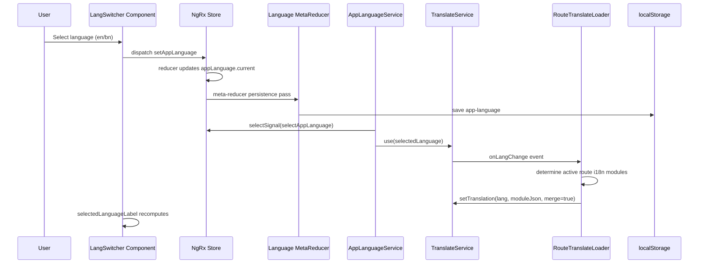
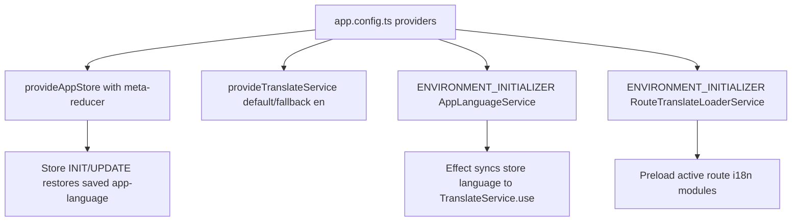

# Language Switcher: Detailed Technical Spec

## 1. Purpose

The language switcher allows users to change application language at runtime.

It is designed so that:

- Language choice is global and centralized in NgRx store.
- UI updates reactively when language changes.
- Selected language persists across refreshes.
- Translation files are loaded by module/route to keep payloads manageable.

---

## 2. Main Files and Responsibilities

- `src/app/shared/components/lang-switcher/lang-switcher.ts`
	- Renders language picker state and dispatches language change action.
- `src/app/shared/components/lang-switcher/lang-switcher.html`
	- Dropdown menu generated from configured language list.
- `src/app/core/configs/app-languages.config.ts`
	- Supported language definitions and validator.
- `src/app/core/store/app-language/*`
	- Action, reducer, selectors for app language state.
- `src/app/core/store/meta-reducers/app-language-storage.metareducer.ts`
	- Persists and restores language from `localStorage`.
- `src/app/core/services/app-language.service.ts`
	- Syncs NgRx language state to `TranslateService.use(...)`.
- `src/app/core/services/module-translate.loader.ts`
	- Loads base translation module (`generic-app`).
- `src/app/core/services/route-translate-loader.service.ts`
	- Loads route/module-specific translation chunks.
- `src/app/app.config.ts`
	- Registers store, translate providers, and environment initializers.

---

## 3. Language Configuration Model

From `app-languages.config.ts`:

- Supported list (`APP_LANGUAGES`): currently `en`, `bn`
- Type safety (`AppLanguage`): union derived from `APP_LANGUAGES`
- Default language (`DEFAULT_APP_LANGUAGE`): `en`
- Runtime guard (`isAppLanguage(value)`): validates persisted values

This setup prevents invalid language values from entering state.

---

## 4. State Management Design (NgRx)

Feature state:

- Feature key: `appLanguage`
- Shape:
	- `AppLanguageState { current: AppLanguage }`

Action:

- `AppLanguageActions.setAppLanguage({ language })`

Reducer behavior:

- Replaces `current` with new selected language.

Selector:

- `selectAppLanguage` returns `state.appLanguage.current`.

---

## 5. Persistence Flow (Meta Reducer)

Storage key:

- `app-language`

On app bootstrap actions (`INIT`, `UPDATE`):

1. Read `localStorage['app-language']`.
2. Validate with `isAppLanguage`.
3. If valid, override store language with saved value.

On every reducer cycle:

1. Determine current language from next state.
2. Persist it back to `localStorage`.

Result:

- Language survives page reload and deploy refresh.

---

## 6. UI Component Behavior

### 6.1 Rendered Value

The switcher computes the visible button label:

- `selectedLanguageLabel = computed(() => currentLanguage().toUpperCase())`.
- This simply uppercases the active language code (for example `EN`, `BN`); it does **not** look up `nativeLabel` from `APP_LANGUAGES`.

### 6.2 Menu Generation

The trigger/menu uses a native `
`/`
` disclosure element (no `menuOpen` boolean state) so the menu opens on click/hover via `group-open:`/`group-hover:` utility classes, and closes when an option is clicked or on outside click (`HostListener('document:click', ...)`).

Menu items are generated with Angular `@for` from `supportedLanguages` (`APP_LANGUAGES`).

Each item shows:

- a small status dot (filled when `currentLanguage() === language.code`, transparent otherwise)
- the native label from `getLanguageLabel(language.code)` — a component method that hardcodes `'বাংলা'` for `bn` and `'English'` for everything else, rather than reading `label`/`nativeLabel` off the `APP_LANGUAGES` config
- the uppercased language code (`language.code.toUpperCase()`)

There is no use of an i18n `language.selected` key in the current markup; selection is communicated only via the status dot and text color.

### 6.3 User Interaction

On click:

1. Template calls `setLanguage(language.code)`.
2. Component dispatches `AppLanguageActions.setAppLanguage({ language })`.
3. Reducer updates global state.
4. Reactive consumers update automatically.

---

## 7. Translate Service Synchronization

`AppLanguageService` is instantiated at startup through `ENVIRONMENT_INITIALIZER`.

During construction it:

1. Registers supported languages in `TranslateService`.
2. Sets fallback language to default (`en`).
3. Creates an Angular `effect` bound to `selectAppLanguage` signal.
4. Calls `translateService.use(language)` whenever store language changes.

This guarantees one-way source of truth:

- Store state drives translation engine.
- UI never directly mutates translate service outside store flow.

---

## 8. How the `| translate` Pipe Works in This App

The app uses `@ngx-translate/core` `TranslatePipe` in templates, for example:

- `{{ 'language.label' | translate }}`
- `{{ 'dashboard.revenue' | translate }}`

What happens at runtime:

1. Template passes the key (for example `dashboard.revenue`) to `TranslatePipe`.
2. `TranslatePipe` reads the active language from `TranslateService`.
3. It resolves the key from already loaded translation objects.
4. When language changes (`TranslateService.use(lang)`), the pipe updates UI text reactively.

Why it works with the switcher flow here:

- `LangSwitcher` dispatches store action `setAppLanguage`.
- `AppLanguageService` watches store language and calls `translateService.use(language)`.
- Route/module loaders ensure required JSON chunks are merged via `setTranslation(..., true)`.
- Because of this, `| translate` always renders from current language + loaded modules.

Important note for standalone components:

- Any standalone component using `| translate` must import `TranslatePipe` in its `imports` array.
- Note: `LangSwitcher` itself currently does **not** use the `| translate` pipe or `TranslatePipe` \u2014 its menu labels are hardcoded in `getLanguageLabel()` rather than driven by translation keys. Other components (for example `ThemeSwitcher`) do rely on `| translate`.

---

## 9. Translation Asset Loading Strategy

### 9.1 Base Loader

`ModuleTranslateLoader` loads:

- `/i18n/generic-app/{lang}.json`

### 9.2 Route-Aware Loader

`RouteTranslateLoaderService` listens to:

- Router `NavigationEnd`
- Translate `onLangChange`

It collects required modules from active route tree using:

- route data key: `i18nModules`
- optional static component property: `i18nModules`

Then it fetches missing module files:

- `/i18n/{moduleName}/{lang}.json`

Loaded module names are cached per language to avoid repeat HTTP calls.

---

## 10. End-to-End Runtime Sequence

---

## 11. Bootstrap Sequence

---

## 12. SSR and Browser Guards

Both translation loaders and storage helper methods contain browser checks.

Why it matters:

- Avoids server-side access to `window`, `localStorage`, and browser-only APIs.
- Keeps SSR/hydration path safe and predictable.

---

## 13. Edge Cases and Expected Results

- Invalid value in `localStorage['app-language']`:
	- Ignored; state falls back to default language.
- Missing module translation file:
	- HTTP error is caught and treated as empty object (`{}`), app keeps running.
- Route changes with same language:
	- Only not-yet-loaded modules are fetched.

---

## 14. How to Add a New Language

1. Add language entry to `APP_LANGUAGES` in config.
2. Add translation files:
	 - `/public/i18n/generic-app/{lang}.json`
	 - other module files as needed (for example `landing`, `auth`).
3. Ensure text keys exist for `language.label` and `language.selected`.
4. Verify language appears in menu and persists after reload.

---

## 15. Quick Verification Checklist

1. Open menu and select `bn` -> visible translated text should switch to Bengali resources.
2. Refresh page -> selected language should remain `bn`.
3. Navigate routes -> route-specific translations should load without full reload.
4. Select `en` -> all texts should revert to English and persist.
5. Check `localStorage['app-language']` updates after each switch.

