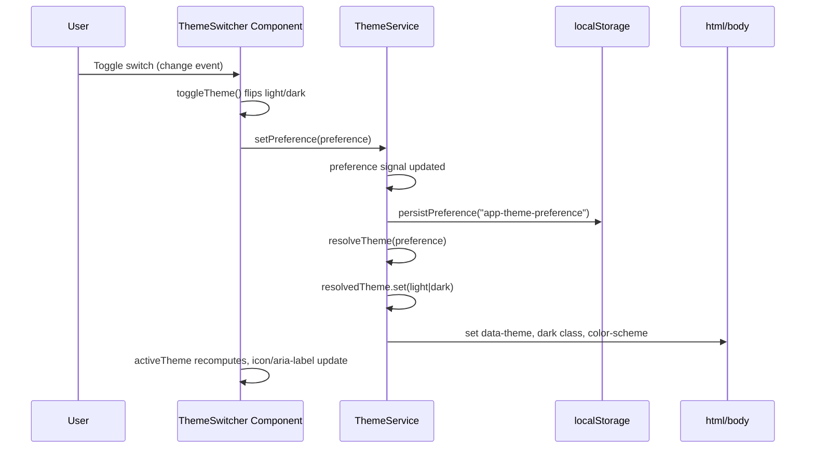
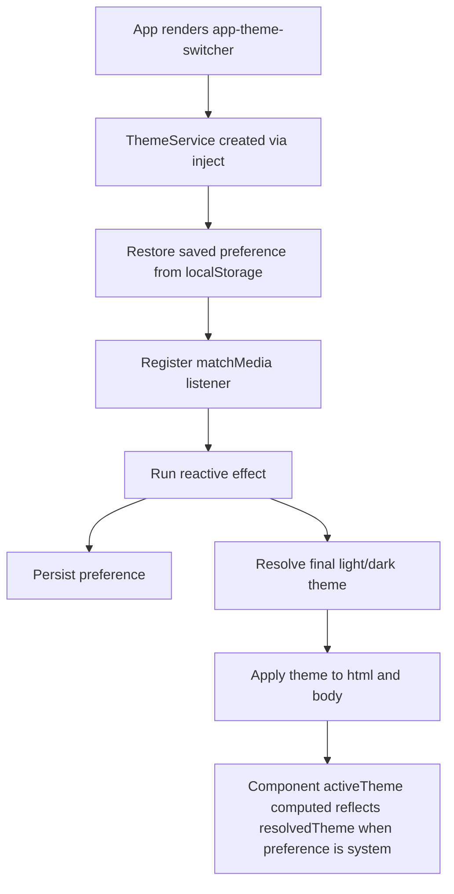

# Theme Switcher: Detailed Technical Spec

## 1. Purpose

The theme switcher allows users to choose how the UI appearance is resolved:

- `system`: follow OS/browser color scheme
- `light`: force light mode
- `dark`: force dark mode

It provides:

- Immediate visual update after selection
- Persistent preference across reloads (via `localStorage`)
- Reactive update when OS theme changes (only while preference is `system`)

---

## 2. Main Files and Responsibilities

- `src/app/shared/components/theme-switcher/theme-switcher.ts`
	- UI logic for the resolved active theme and toggle handler.
- `src/app/shared/components/theme-switcher/theme-switcher.html`
	- A single checkbox-styled toggle switch (light/dark only — there is no `system` option exposed in this UI, even though `ThemeService` still supports it).
- `src/app/core/services/theme.service.ts`
	- Source of truth for theme preference and resolved theme.
	- Handles persistence and DOM theme application.
- `src/app/app.ts` + `src/app/app.html`
	- Registers and renders the `app-theme-switcher` component.

---

## 3. Data Model

Defined in `theme.service.ts`:

- `ThemePreference = 'system' | 'light' | 'dark'`
- `ResolvedTheme = 'light' | 'dark'`

Signals in service:

- `preference`: user selected mode (`system`/`light`/`dark`)
- `resolvedTheme`: final mode applied to DOM (`light`/`dark`)

Storage key:

- `app-theme-preference`

---

## 4. Component Behavior

### 4.1 Display State

The component exposes a single computed value:

- `activeTheme: computed<'light' | 'dark'>`
	- if `themeService.preference()` is `'system'`, returns `themeService.resolvedTheme()`
	- otherwise returns the preference directly (`'light'` or `'dark'`)

The template is a `<label>`/checkbox toggle (no dropdown, no `menuOpen` state). It swaps a sun/moon SVG icon on the thumb and drives `aria-label`/`title`/`aria-checked` off `activeTheme()`, using the `theme.appearance`, `theme.light`, `theme.dark` translation keys via `| translate`.

### 4.2 User Action

When the user toggles the switch:

1. The checkbox `(change)` event calls `toggleTheme()`.
2. `toggleTheme()` calls `setTheme(activeTheme() === 'light' ? 'dark' : 'light')`.
3. `setTheme(preference)` calls `themeService.setPreference(preference)`.
4. Service signal updates and triggers reactive effect.

Note: this UI can only ever set the preference to `'light'` or `'dark'` — there is currently no control that sets `'system'` (a user who had `'system'` restored from storage will move off it as soon as they use the toggle).

---

## 5. Service Lifecycle and Flow

### 5.1 On Service Construction

1. Restore saved preference from `localStorage` (browser only).
2. Create `matchMedia('(prefers-color-scheme: dark)')` listener (browser only).
3. Register cleanup for media listener on destroy.
4. Register `effect` that always:
	 - persists preference
	 - resolves active theme
	 - applies theme to DOM

### 5.2 System Theme Change Handling

If OS theme changes:

- Listener fires.
- If current preference is `system`, service recalculates `resolvedTheme`.
- DOM attributes/classes are updated immediately.

If preference is `light` or `dark`, system changes are ignored.

---

## 6. DOM Application Strategy

Theme is applied to both `documentElement` (`html`) and `body`:

- `data-theme="light|dark"`
- `classList.toggle('dark', theme === 'dark')`
- `style.colorScheme = theme`

Why both `html` and `body`:

- Supports CSS selectors based on data attribute/class at either level.
- Keeps browser native color-scheme aware controls aligned with app theme.

---

## 7. End-to-End Sequence

---

## 8. Startup Flow

---

## 9. SSR and Platform Safety

The service checks `isPlatformBrowser` before touching:

- `window`
- `localStorage`
- `matchMedia`

This prevents server-side rendering crashes.

---

## 10. Edge Cases and Expected Result

- Missing/invalid stored value:
	- Falls back to default `system`.
- Browser without saved preference:
	- Starts from `system`, resolves by media query.
- User selects `system` on unsupported `matchMedia` contexts:
	- Falls back to `light` when no dark match is available.

---

## 11. How to Extend

- Add new theme preference:
	- Extend `ThemePreference` union.
	- Update resolver and menu options.
	- Ensure DOM application logic still maps to final `light`/`dark` style strategy.
- Add custom theme tokens:
	- Continue using `data-theme` and `dark` class as stable CSS hooks.

---

## 12. Quick Verification Checklist

1. Toggle the switch to dark -> UI should become dark and stay dark after reload.
2. Toggle the switch back to light -> UI should become light and stay light after reload.
3. Note: the toggle UI has no `system` control; `system` can only be the initial state restored from a previously saved preference (or a fresh install default), and any toggle click moves it to an explicit `light`/`dark` value.
4. Confirm `localStorage['app-theme-preference']` is updated after each toggle.

